
🇷🇺 <strong>Русский</strong> | 🇬🇧 <a href="README_EN.md">English</a> | 🇨🇳 <a href="README_ZH.md">中文</a>

<h1>Визуализация ИИ агентов Claude и Codex в real time в браузере</h1>

  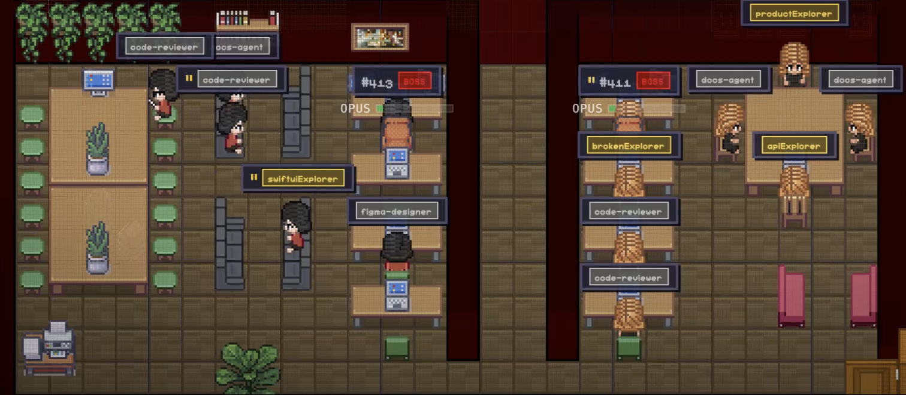

YouTube: <a href="https://www.youtube.com/watch?v=seJ8nwOdRYA" target="_blank">https://www.youtube.com/watch?v=seJ8nwOdRYA</a>

Пиксельный офис для <code>Claude CLI</code>, <code>Claude macOS app</code> с базовой поддержкой <code>Codex</code>.

Real-time визуализация агентов Claude и Codex: кто появился в офисе, кто кого вызвал, кто над чем работает, кто простаивает, сколько токенов сгорает и как между собой общаются агенты прямо во время сессии.

Отдельное браузерное приложение, которое превращает агентные сессии Claude в живой пиксельный офис: агенты появляются в заданной точке, собираются кластерами, тянутся друг к другу, работают за столами, отдыхают на софах и оставляют понятный "бумажный след" в сайдбарах. Не требует API, использует ваш аккаунт. Никаких дополнительных расходов на токены.

<h2>Обзор</h2>

Когда вы хотите видеть живую карту работы ИИ агентов: кто кого вызвал, кто над чем занят, сколько токенов тратится, что обсуждают агенты между собой и какие issues сейчас активны в репозитории.

<h2>Визуальный обзор</h2>

Главная идея интерфейса: не просто список сессий, а живая карта офиса, где видно иерархию, кластеры, события, точки спавна, ожидание апрува и отдельные каналы общения между агентами.

<h3>Главный офис</h3>

  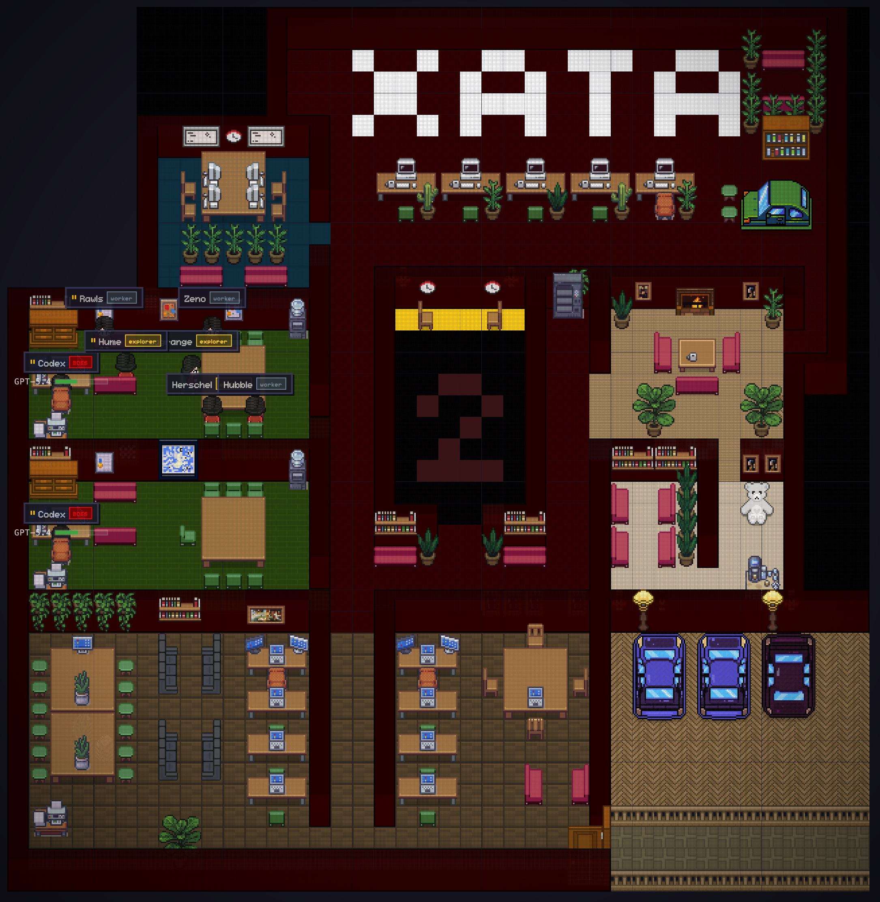

<h3>Кресло босса</h3>

  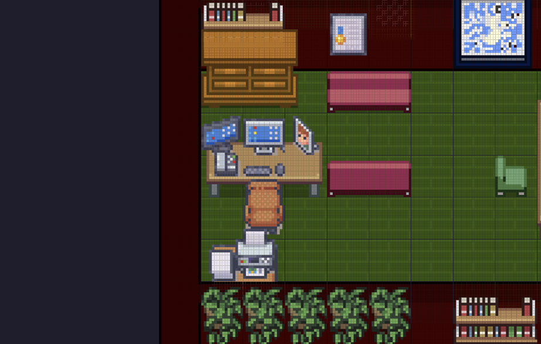

<h3>Иерархия</h3>

  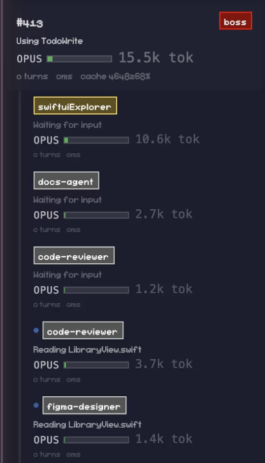

<h3>Кластеризация</h3>

  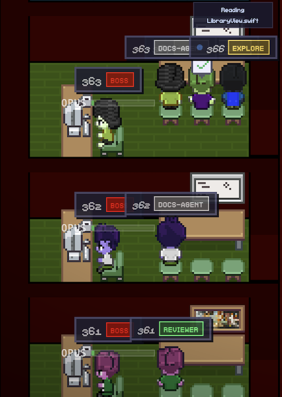

<h3>Отслеживание общения</h3>

  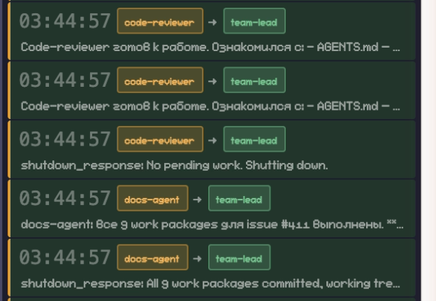

<h3>События</h3>

  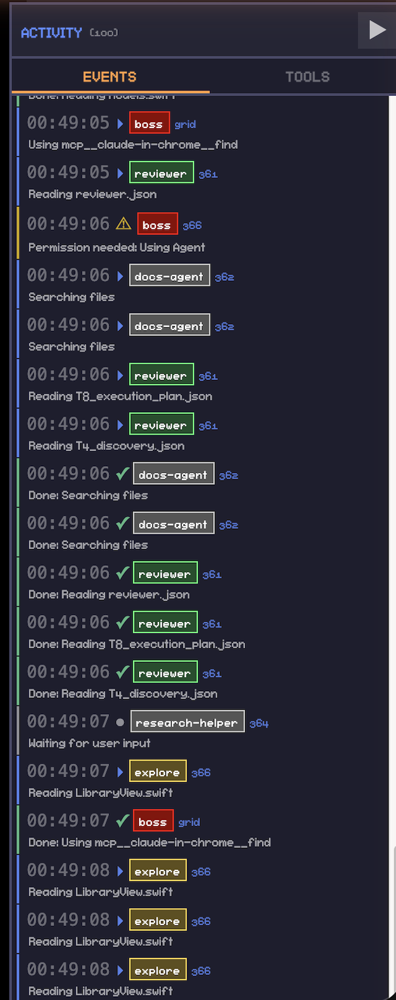

<h3>Оповещения об ожидании апрува</h3>

  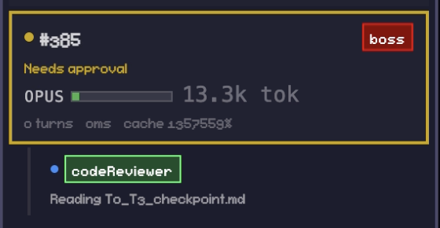

<h3>Точка появления</h3>

  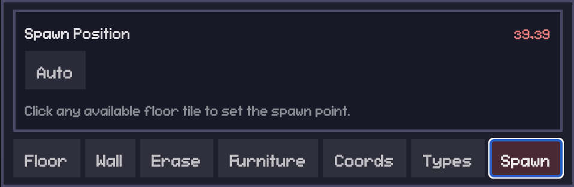

<h3>Импорт/экспорт для шаринга</h3>

  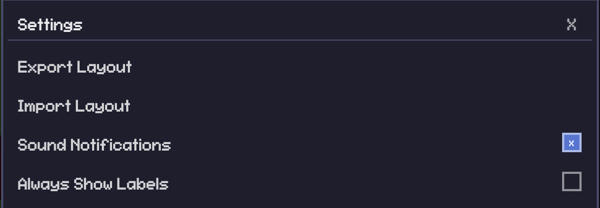

<h3>Дополнительные ассеты</h3>

  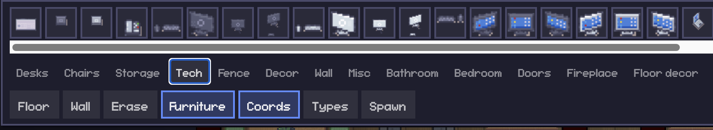

<h3>Поддержка Codex</h3>

  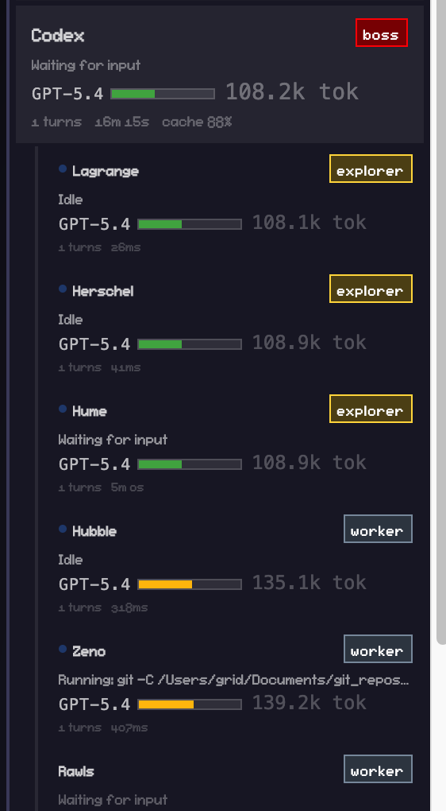

  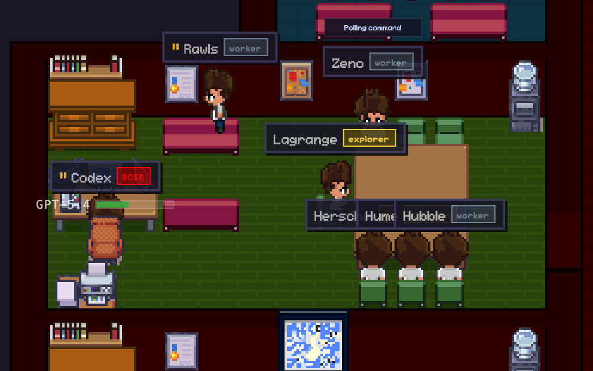

<h3>HUD — Метрики агентов</h3>

  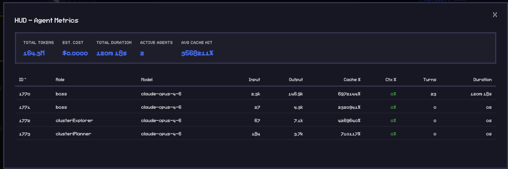

Полноэкранная панель метрик: токены, стоимость, cache hit rate, context usage на каждого агента. Сортировка по любому столбцу. Предупреждения о bottleneck (низкий cache hit, высокий context fill).

<h3>Idle-активности: софа, кофе, перекур</h3>

  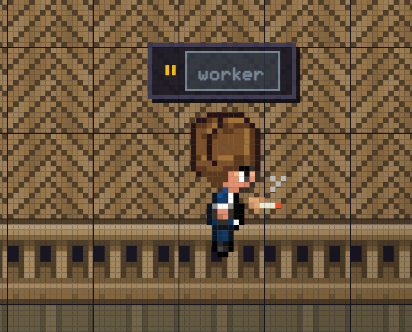

Простаивающие агенты выбирают одну из трёх активностей (33% каждая): отдых на софе, кофе у кулера или перекур. Каждая активность со своим спрайтом и анимацией.

<h3>Визуализация команд</h3>

  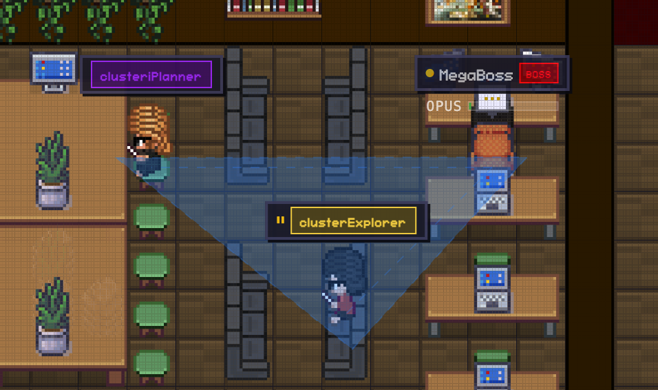

Кнопка "Show teams" рисует тайловые области с заливкой и сплошной толстой границей по внешнему периметру кластера. Автоматически определяет иерархию через цепочку parentAgentId. Convex hull объединяет всех участников команды в одну область.

<h3>Трансляция офиса</h3>

  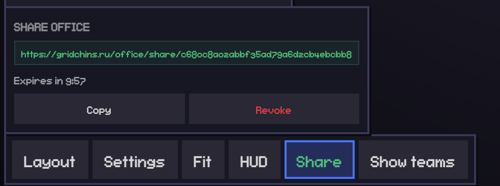

Кнопка Share генерирует временную ссылку (10 или 60 минут) для друзей и коллег. Режим "только просмотр": без кнопок управления, без Tasks. Поддержка публичного URL через SSH tunnel + relay сервер. На мобильных устройствах показывает уведомление "отображение доступно только с desktop".

<h3>Уведомления</h3>

Браузерные уведомления при запросе разрешения, завершении задачи, появлении нового агента. Включается в Settings.

<h3>Multi-Daemon (экспериментально)</h3>

Подключение к удалённым серверам pixel-agents. Единый офис с namespace агентов. Настраивается через <code>~/.pixel-agents/config.json</code>.

<h3>Кроссплатформенность</h3>

Работает на macOS, Linux, Windows. AppleScript заменён на кроссплатформенные утилиты.

<h2>Возможности</h2>

<ul>
  <li>Кресло босса: его может занять только BOSS/MEGABOSS агент. Lead и остальные садятся на обычные места.</li>
  <li>Строгая иерархия: агент, который вызвал другого агента, выше в иерархии.</li>
  <li>Кластерное поведение: агенты собираются рядом и визуально тянутся к связанным участникам работы.</li>
  <li>Левый сайдбар с агентами, их ролями, токенами, контекстом и статусами.</li>
  <li>Отдельный сайдбар с задачами из GitHub-репозитория.</li>
  <li>Расширенный пак предметов.</li>
  <li>Настраиваемый прогресс-бар под ваш pipeline через <code>~/.pixel-agents/config.json</code>.</li>
  <li>Расширенный набор встроенных office assets, работающий из коробки.</li>
  <li>Сайдбар событий с фактом общения агентов между собой.</li>
  <li>Просмотр чата конкретного агента и deep inspection по double-click.</li>
  <li>Координата появления агентов и точка ухода учитываются в layout и рендере.</li>
  <li>Подсветка координат, подсветка типов ячеек и подписи агентов.</li>
  <li>Умное добавление имени агента по специальности.</li>
  <li>Если агент простаивает, он может уйти на софу, пить кофе или курить (33/33/33); каждая активность со своим спрайтом и анимацией.</li>
  <li>Soft zoom через touchpad/pinch и плавный pan по canvas.</li>
  <li>Кнопка Fit — авто-масштаб офиса между сайдбарами.</li>
  <li>Базовая поддержка Codex-сессий и subagents уже есть, но это ещё early version.</li>
</ul>

<h2>Требования</h2>

<ul>
  <li><code>Claude CLI</code> или <code>Claude macOS app</code> (macOS, Linux, Windows)</li>
  <li>Node.js <code>20.19+</code></li>
  <li><code>npm</code></li>
  <li>Опционально: GitHub CLI <code>gh</code> для сайдбара задач (TASKS)</li>
</ul>

<h2>Быстрый старт</h2>

Одна команда — и офис запущен:

<pre><code class="language-bash">npx office-for-claude-agents
</code></pre>

Автоматически установит зависимости, соберёт проект и откроет браузер на <code>http://localhost:9876</code>.

  
Из исходников

<pre><code class="language-bash">git clone https://github.com/percheniy/office-for-claude-agents.git \
  &amp;&amp; cd office-for-claude-agents \
  &amp;&amp; npm install \
  &amp;&amp; npm start
</code></pre>

Откройте:

<pre><code>http://localhost:9876
</code></pre>

На первом запуске приложение само создаёт <code>~/.pixel-agents/layout.json</code> из bundled default layout, который уже включён в репозиторий.

Источники сессий ищутся автоматически в стандартных директориях <code>~/.claude/projects</code>, <code>~/.codex/sessions</code> и <code>~/.codex/archived_sessions</code>. Если у вас кастомные пути, можно переопределить их через <code>PIXEL_AGENTS_CLAUDE_PROJECTS_DIR</code>, <code>PIXEL_AGENTS_CODEX_SESSIONS_DIR</code>, <code>PIXEL_AGENTS_CODEX_ARCHIVED_SESSIONS_DIR</code> или через <code>~/.pixel-agents/config.json</code>.

<h2>Использование</h2>

<h3>Claude CLI / Claude macOS app</h3>

Приложение отслеживает:

<ul>
  <li><code>~/.claude/projects</code></li>
  <li><code>~/.codex/sessions</code></li>
  <li><code>~/.codex/archived_sessions</code> — для архивных Codex-сессий</li>
</ul>

Этого достаточно для <code>Claude CLI</code>, <code>Claude macOS app</code> и базового отображения <code>Codex</code> агентов.

Если стандартные папки отсутствуют, приложение всё равно стартует и явно покажет в левом сайдбаре, какие пути проверялись и чем их переопределить.

<pre><code class="language-json">{
  "sessionSources": {
    "claudeProjectsDir": "/absolute/path/to/claude/projects",
    "codexSessionsDir": "/absolute/path/to/codex/sessions",
    "codexArchivedSessionsDir": "/absolute/path/to/codex/archived_sessions"
  }
}
</code></pre>

<h3>Сайдбар задач (TASKS)</h3>

По умолчанию TASKS работает в generic режиме:

<ul>
  <li>показывает open GitHub issues активного репозитория;</li>
  <li>не наследует мой личный pipeline;</li>
  <li>тихо деградирует, если <code>gh</code> не настроен.</li>
</ul>

Если хотите свой pipeline progress bar, добавьте конфиг в <code>~/.pixel-agents/config.json</code>:

<pre><code class="language-json">{
  "githubTasks": {
    "enabled": true,
    "maxIssues": 30,
    "pipeline": {
      "enabled": true,
      "states": [
        { "id": "todo", "label": "To Do", "color": "#fc0", "labels": ["todo", "backlog"] },
        { "id": "in_progress", "label": "In Progress", "color": "#3794ff", "labels": ["in-progress", "wip"] },
        { "id": "review_ready", "label": "Review", "color": "#a78bfa", "labels": ["review-ready"] },
        { "id": "done", "label": "Done", "color": "#5ac88c", "labels": ["done"] },
        { "id": "blocked", "label": "Blocked", "color": "#e55", "labels": ["blocked"] }
      ],
      "gates": [
        { "gate": 5, "label": "DOC" },
        { "gate": 8, "label": "PLN" },
        { "gate": 11, "label": "REV" }
      ]
    }
  }
}
</code></pre>

<h2>Редактор layout</h2>

<ul>
  <li>Экспорт / импорт layout в JSON</li>
  <li>Кресло босса и ролевые ограничения мест</li>
  <li>Редактирование точки спавна</li>
  <li>Подсветка координат</li>
  <li>Подсветка типов ячеек</li>
  <li>Размещение мебели, поворот, удаление, undo/redo</li>
  <li>Zoom через touchpad + pan для больших офисов</li>
</ul>

<h2>Ассеты офиса</h2>

Встроенные assets входят в репозиторий и достаточны для первого запуска.

Основной встроенный набор лежит в <code>webview-ui/public/assets</code>: characters, floors, walls, furniture manifests, sprites и bundled default layout.

Дополнительные ассеты можно подключать через external asset directories. Если у вас есть коммерческие tilesets, подключайте их отдельно и локально, не коммитьте их в публичный репозиторий без лицензии.

<h2>Технологии</h2>

<ul>
  <li>Node.js</li>
  <li>Express</li>
  <li>WebSocket (<code>ws</code>)</li>
  <li>React 19</li>
  <li>TypeScript</li>
  <li>Vite</li>
  <li>Canvas 2D рендеринг</li>
  <li>Интеграция с <code>gh</code> CLI для трекинга issues</li>
</ul>

<h2>Известные ограничения</h2>

<ul>
  <li>Поддержка Codex базовая и требует доработки.</li>
  <li>Сайдбар TASKS зависит от аутентификации <code>gh</code> для отображения GitHub issues.</li>
  <li>Pipeline progress включается через конфиг, автоматически не определяется.</li>
  <li>Форматы сессий Claude и Codex могут меняться; парсеры потребуют обновления со временем.</li>
  <li>Share-ссылки требуют SSH-туннель к публичному серверу для внешнего доступа; токены хранятся в памяти и сбрасываются при перезапуске сервера.</li>
</ul>

<h2>Star History</h2>

<a href="https://www.star-history.com/?repos=percheniy%2Foffice-for-claude-agents&type=date&legend=top-left">
 <picture>
   <source media="(prefers-color-scheme: dark)" srcset="https://api.star-history.com/image?repos=percheniy/office-for-claude-agents&type=date&theme=dark&legend=top-left" />
   <source media="(prefers-color-scheme: light)" srcset="https://api.star-history.com/image?repos=percheniy/office-for-claude-agents&type=date&legend=top-left" />
   
 </picture>
</a>

<h2>Credits</h2>

<ul>
  <li><a href="https://github.com/pablodelucca/pixel-agents">pablodelucca/pixel-agents</a> by Pablo De Lucca</li>
  <li>Pablo De Lucca for standalone groundwork</li>
  <li>Sergey Gridchin for public standalone additions, Codex support, task sidebar generalization, richer inspection, and release packaging</li>
</ul>

  
License

  
This repository contains code derived from or based on <code>pablodelucca/pixel-agents</code>.

  <ul>
    <li>Original upstream code remains under the MIT License.</li>
    <li>Original copyright notices and license notices must be preserved.</li>
    <li>Clearly marked files created by Sergey Gridchin are governed by the Sergey Source-Available Noncommercial License 1.0 as stated in the root <code>LICENSE</code> file.</li>
    <li>That separate license applies only to clearly marked Sergey-authored additions, not to upstream-origin or derivative MIT-governed portions.</li>
    <li>If this repository is a fork or substantial modification of <code>pixel-agents</code>, it is not legally safe to claim a stricter license for the whole repository in a way that removes rights already granted by MIT.</li>
    <li>In case of conflict, the original upstream MIT License continues to govern all upstream portions and derivative portions that remain subject to that license.</li>
  </ul>

  
Short form:

  <pre><code>Licensing notice

This repository includes code derived from or based on pablodelucca/pixel-agents.
Original upstream code remains subject to its original MIT License, and all
applicable copyright and license notices must be preserved.

Unless otherwise stated in a file header, files originating from the upstream
project or derived from it are provided under the MIT License.

Files and materials clearly marked as:
Copyright (c) 2026 Sergey Gridchin
are licensed under the Sergey Source-Available Noncommercial License 1.0.

In case of conflict, the original upstream MIT License continues to govern all
upstream portions and derivative portions that remain subject to that license.
</code></pre>

  
See the root <code>LICENSE</code> file for the canonical text used in this repository.

